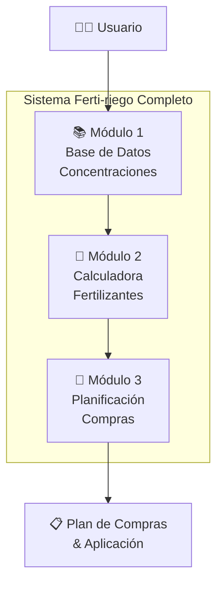
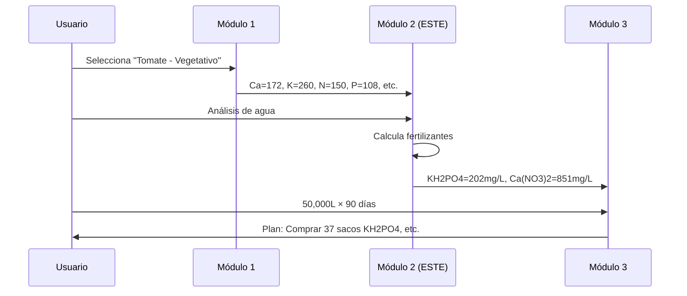
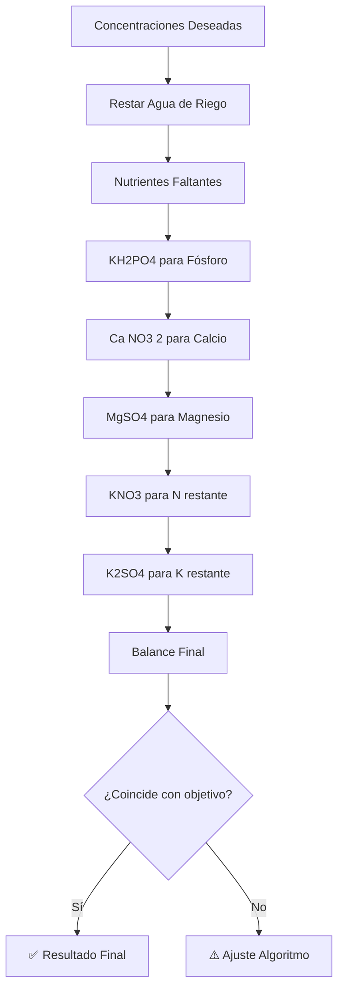

# 🌱 Módulo 2: Calculadora de Soluciones Nutritivas

## Descripción

Este módulo es parte del sistema **Ferti-riego** y se encarga de calcular las cantidades exactas de fertilizantes necesarias para alcanzar concentraciones específicas de nutrientes en soluciones hidropónicas.

## 📋 Arquitectura del Sistema Completo



### Módulo 1: Base de Datos de Concentraciones
- **Función**: Proporciona concentraciones óptimas por cultivo y etapa
- **Input**: Cultivo + Etapa de desarrollo
- **Output**: Concentraciones objetivo (Ca, K, Mg, N, P, S)
- **Estado**: 🔴 No implementado

### Módulo 2: Calculadora de Fertilizantes (ESTE MÓDULO)
- **Función**: Calcula fertilizantes necesarios para alcanzar concentraciones
- **Input**: Concentraciones objetivo + Análisis de agua
- **Output**: Lista de fertilizantes con cantidades exactas
- **Estado**: ✅ Implementado

### Módulo 3: Planificación de Compras
- **Función**: Escala cálculos a nivel comercial y optimiza compras
- **Input**: Fertilizantes calculados + Volumen total + Duración ciclo
- **Output**: Plan de compras, costos, proveedores, cronogramas
- **Estado**: 🔴 No implementado

## 🔄 Flujo de Datos



## 🧮 Algoritmo de Cálculo (Módulo 2)

### Entrada
```csharp
// Concentraciones objetivo (mg/L)
Dictionary<string, double> targetConcentrations = {
    ["Ca"] = 172.0,
    ["K"] = 260.0,
    ["Mg"] = 50.0,
    ["N"] = 150.0,
    ["P"] = 108.0,
    ["S"] = 45.0
};

// Análisis de agua (mg/L)
WaterAnalysis water = {
    Elements_mgL = { ["Ca"] = 10, ["K"] = 2, ["Mg"] = 5 }
};
```

### Proceso de Cálculo



### Salida
```csharp
List<FertilizerResult> results = [
    {
        Name: "KH2PO4",
        Concentration_mgL: 202.0,
        ElementContribution: { P: 45.0, K: 56.8 }
    },
    {
        Name: "Ca(NO3)2.2H2O", 
        Concentration_mgL: 851.0,
        ElementContribution: { Ca: 162.0, N: 113.2 }
    }
    // ... más fertilizantes
];
```

## 📊 Formato de Resultados

### Tabla 1: Fertilizantes
| FERTILIZANTE | P% | PM Sal | mg/L | mmol/L | Ca | K | Mg | NO3-N | SO4-S | H2PO4-P |
|--------------|----|----|------|--------|----|----|----|----|----|----|
| KH2PO4 | 98 | 136.19 | 202.0 | 1.48 | 0.0 | 56.8 | 0.0 | 0.0 | 0.0 | 45.0 |
| Ca(NO3)2.2H2O | 95 | 200.00 | 851.0 | 4.26 | 162.0 | 0.0 | 0.0 | 113.2 | 0.0 | 0.0 |

### Tabla 2: Balance de Iones
| ELEMENTO | APORTE (mg/L) | AGUA (mg/L) | FINAL (mg/L) | OBJETIVO |
|----------|---------------|-------------|--------------|----------|
| Ca | 162.0 | 10.0 | 172.0 | ✅ 172.0 |
| K | 258.0 | 2.0 | 260.0 | ✅ 260.0 |
| N | 113.2 | 0.0 | 113.2 | ⚠️ 150.0 |

## 🔧 Uso del Módulo

### Instalación
```bash
dotnet build
dotnet run
```

### Uso Programático
```csharp
var calculator = new NutrientCalculatorAdvanced();

// Configurar concentraciones objetivo
calculator.SetTargetConcentrations(targetConcentrations);

// Configurar análisis de agua
calculator.SetWaterAnalysis(waterAnalysis);

// Calcular solución
var results = calculator.CalculateSolution();

// Obtener balance de iones
var balance = calculator.CalculateIonBalance(results);
```

### Uso por Consola
```bash
=== CALCULADORA DE SOLUCIÓN NUTRITIVA ===

Ingrese las concentraciones deseadas (mg/L):
Ca: 172
K: 260
Mg: 50
N: 150
P: 108
S: 45
```

## 🔗 Interfaces para Integración

### Para conectar con Módulo 1
```csharp
public interface IConcentrationProvider 
{
    Dictionary<string, double> GetConcentrations(string crop, string stage);
    bool ValidateConcentrations(Dictionary<string, double> concentrations);
}
```

### Para conectar con Módulo 3
```csharp
public interface IFertilizerCalculator 
{
    List<FertilizerResult> CalculateFertilizers(
        Dictionary<string, double> targetConcentrations,
        WaterAnalysis waterAnalysis
    );
    
    IonBalance GetIonBalance(List<FertilizerResult> results);
}
```

## 🧪 Fertilizantes Soportados

| Fertilizante | Fórmula | Aporta | Uso Principal |
|--------------|---------|--------|---------------|
| **KH2PO4** | Fosfato monopotásico | P, K | Fósforo |
| **Ca(NO3)2.2H2O** | Nitrato de calcio | Ca, N | Calcio |
| **MgSO4.7H2O** | Sulfato de magnesio | Mg, S | Magnesio |
| **KNO3** | Nitrato de potasio | K, N | Nitrógeno/Potasio |
| **K2SO4** | Sulfato de potasio | K, S | Potasio |

## ⚙️ Optimizaciones Implementadas

### Control de Excesos
- **Nitrógeno**: Si Ca(NO3)2 aporta exceso de N, usa cantidad parcial
- **Azufre**: Optimiza K2SO4 vs MgSO4 para evitar exceso de S
- **Balance iónico**: Verifica que cationes ≈ aniones

### Algoritmo Inteligente
1. **Prioridad por elemento crítico**: P primero (solo una fuente)
2. **Decisiones condicionales**: Ca(NO3)2 vs combinaciones
3. **Optimización final**: K restante con mejor opción S

## 📈 Próximas Mejoras

- [ ] Soporte para micronutrientes (Fe, Mn, Zn, B, etc.)
- [ ] Cálculo de pH y ajuste con ácidos
- [ ] Validación de límites de solubilidad
- [ ] Verificación de compatibilidades entre fertilizantes
- [ ] Optimización por costos de fertilizantes
- [ ] Soporte para soluciones concentradas (factor 1:50 a 1:400)

## 📝 Ejemplo de Integración Completa

```csharp
// Flujo completo del sistema
var concentrationProvider = new DatabaseConcentrationProvider();
var calculator = new NutrientCalculatorAdvanced();
var purchasePlanner = new PurchasePlanningModule();

// 1. Obtener concentraciones de BD
var concentrations = concentrationProvider.GetConcentrations("Tomate", "Vegetativo");

// 2. Calcular fertilizantes (ESTE MÓDULO)
calculator.SetTargetConcentrations(concentrations);
var fertilizers = calculator.CalculateSolution();

// 3. Planificar compras
var purchasePlan = purchasePlanner.CreatePlan(fertilizers, 50000, 90);
```

## 🤝 Contribución

Este módulo es parte del sistema **Ferti-riego** desarrollado según especificaciones del documento técnico IAPSOFT para cultivos hidropónicos.

### Estructura del Proyecto
```
/
├── NutrientCalculatorAdvanced.cs  # Calculadora principal
├── Models/
│   ├── Fertilizer.cs             # Modelo de fertilizante
│   ├── WaterAnalysis.cs          # Análisis de agua
│   └── FertilizerResult.cs       # Resultados de cálculo
├── Interfaces/
│   ├── IConcentrationProvider.cs # Para Módulo 1
│   └── IFertilizerCalculator.cs  # Para Módulo 3
└── README.md                     # Este archivo
```

---

**Nota**: Este es el **Módulo 2** del sistema Ferti-riego. Para el sistema completo, se requiere implementar los Módulos 1 y 3 según la arquitectura descrita.